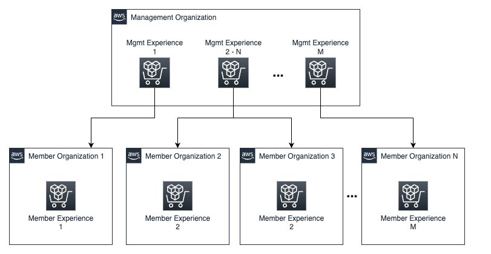

# Managing Private Marketplace across multiple AWS Organizations

A multi-account strategy is [Amazon Webs Services (AWS)](https://docs.aws.amazon.com/) recommended practice for achieving higher isolation of resources in AWS. It also helps you to meet regulatory and compliance needs, track operational costs, and add an extra layer of security by reducing the scope of a security incident. [AWS Control Tower](https://aws.amazon.com/controltower/) helps companies to set up a multi-account environment using a single organization within [AWS Organizations](https://aws.amazon.com/organizations/), but multinationals, consortia, and government entities have started to take this a step further and are architecting their AWS environment using multiple AWS organizations. This allows them to more closely match their physical structure as a group of individual entities or companies following common sets of directives and compliances. This also provides simplified cost allocation and chargebacks. 

[AWS Marketplace](https://aws.amazon.com/marketplace/) is a digital catalog with thousands of software listings from independent software vendors (ISVs) that make it easy to find, test, buy, and deploy software that runs on AWS. Private Marketplace is a feature built on top of AWS Marketplace and enables administrators to create and customize curated digital catalogs or experiences of approved products that conform to in-house policies. Users can only subscribe to approved products, ensuring that all procured products comply with the organization’s policies and standards.

As with other AWS services and features, Private Marketplace is designed to work within the boundaries of a single organization. In this post, I will introduce a distributed serverless solution that will enable you to keep Private Marketplace experiences in multiple organizations synchronized and manage them from a central management organization. 


## Prerequisites

1.	Administrator access to the management account of the management organization
2.	Administrator access to a member account of the management organization
3.	Administrator access to the management account of the member organization(s)
4.	Administrator access to a member account of the member organization(s) 

## Solution overview 

First, I want to define some terminology that I will use throughout the blog post.

1.	**Experience**: A catalog of approved and rejected products
2.	**Management organization**: The organization that manages all experiences centrally
3.	**Member organization**: An organization whose experiences will be managed remotely from the management organization
4.	**Management experience**: A catalog of approved and rejected products defined in the management organization that manages one or many member experiences
5.	**Member experience**: A catalog of approved and rejected products in the member organization that is kept synchronized with its management experience

This distributed serverless solution provides a centralized way for managing Private Marketplace across multiple organizations. I built the solution to address the first use case in the following list, but the solution is flexible enough to address the second use case as well.

1.	A management experience manages all member experiences in a single- or multiple-member organization.
2.	A management experience manages selected member experience(s) in a single- or multiple-member organization. In this use case, you can also create non-managed member experiences that are managed locally in your member organization(s).

Note that you can create multiple management experiences, so you can manage member organizations independently from each other. In the following diagram, you can see a visual representation of the use cases I have described. 





In this post, I provide step-by-step instructions to set up the first use case, but I also provide the information to address the second use case when it deviates. So, you can also set up the second use case. 

The solution is composed of two components.

1.	The Private Marketplace cross-organization management component, which gets deployed in the management organization.
2.	The Private Marketplace cross-organization member component, which gets deployed in the member organization(s).

You need to deploy both components in the appropriate AWS Organizations for each member organization that you would like to centrally manage. The component in the management organization monitors the management experience provided by you as a parameter, and it triggers the second component in the member organization(s) in an hourly interval. The second component makes sure that the experience(s) in the member organization(s) are identically set up as the management experience in the management organization. Once the member experience(s) are synchronized, the component updates the synchronization timestamp in the management organization. The synchronization timestamp logs the synchronized experience id(s) and when it happens. This is done to provide observability.

The following architecture diagram illustrates both components deployed in the management organization and the member organization.

In the management organization:

1.	An Amazon EventBridge rule runs hourly and triggers an [AWS Lambda](https://aws.amazon.com/lambda/) function. 
2.	The Lambda function reads the approved and rejected products from the management experience.
3.	The Lambda function writes the approved and rejected products to [Amazon DynamoDB](https://aws.amazon.com/dynamodb/) tables.
4.	The Lambda function sends a notification through Amazon [Simple Notification service (Amazon SNS)](https://aws.amazon.com/sns/).

In the member organization(s):

5.	The notification is received by an [Amazon Simple Queue Service (Amazon SQS)](https://aws.amazon.com/sqs/) queue.
6.	The queue triggers the synchronization Lambda function to read the products from DynamoDB in the management organization.
7.	The Lambda function synchronizes the member experience(s).
8.	The Lambda function updates the DynamoDB table in the management organization with the finished synchronization timestamp.


## Solution walkthrough: Managing Private Marketplace across multiple organizations

#### Step 1: Create a private marketplace experience in every organization and delegated administration

To use Private Marketplace, you first need to enable it. You will enable a Private Marketplace in each of your organizations. 

It is security best practices to avoid using your management account as much as possible. For that purpose you will also identify in each organization an account other than your management account to activate Private Marketplace delegated administration and deploy the components of this solution. Take note of those AWS account Id because you need it to grant AWS Organizations delegated administration to it. 

1.	Sign in as administrator to each management account.
2.	Visit the [Private Marketplace](https://aws.amazon.com/marketplace/privatemarketplace/create) console.
3.	To access the full functionality of Private Marketplace, acknowledge **Enable trusted access across your organization** and **Enable a private marketplace service-linked role for this account**.
4.	Select **Enable private marketplace**. This will take a minute.
5.	In the Private Marketplace administration, in the left menu, select [Settings](https://aws.amazon.com/marketplace/privatemarketplace#/settings).
6.	In the **Delegated administrator** section, select **Register a new administrator**.
7.	Enter the account Id you identified to be your delegated administration account and select **Register**.

Repeat these steps in each organization.

#### Step 2: Create an experience in each member organization that you would like to centrally manage

In this step, you create the member experience(s) that will be kept in sync with the management experience in the management organization. To make this experience and govern all accounts in your organization, you need to associate the experience with your AWS Orgnizations root node.  

1.	Sign in as administrator to your member organization’s designated administrator account.
2.	Visit the [Private Marketplace administration](https://aws.amazon.com/marketplace/privatemarketplace#/dashboard) console.
3.	From the left menu, select **Experiences**. On the right menu, choose **Create experience**.
4.	Enter a name and a description for your experience, and choose **Create experience**. It will take a minute for the experience to be created.
5.	Select the experience, and from the tabs on top, choose **Associate audience**.
6.	Select **Add additional audience**, mark your organization root node and select **Next**.
7.	Verify that the **Type** is **Organization** and select **Associate with experience**. It will take a minute for the experience to be associated. 

The solution only synchronizes live experiences, so you need to set the experience to live. Keep in mind that at the moment you set the experience to live, all accounts will be governed and will only be able to subscribe to products approved in the experience. Already subscribed products will not be affected. 
 
1.	From the left menu, select **Experiences**.
2.	Select the experience, and from the top tabs, choose **Settings**.
3.	Change the **Experience mode** to **Live**.
4.	Scroll to the bottom and choose **Save**. It will take a minute for the experience to become live, but you can already move to the next member organization and repeat all the points.

#### Step 3: Create an experience in the management organization to centrally manage member experience(s)

You need to create an experience in your management organization to manage a single or multiple member experience(s). Just as in the member organization(s), you will log in in the Private Marketplace delegated administration account you identify in Step 1 for your your management organization. 

1.	Sign in as administrator to your management organization’s delegated administrator account. 
2.	Visit the [Private Marketplace administration](https://aws.amazon.com/marketplace/privatemarketplace#/dashboard) console.
3.	From the left menu, select **Experiences**. On the right menu, choose **Create experience**.
4.	Enter a name and description for your experience. Think about a naming convention to easily identify the managed member organization(s).
5.	Choose **Create experience**. It will take a minute for the experience to be created.
6.	You need the experience-id because you will use it to deploy the solution in the next step. To find the id, select the experience.
7.	After the page reloads, in your browser address bar, copy the last segment of the URL after the last slash. That is the experience id.


#### Step 4: Deploy the management component of the solution

In this step, you will deploy the management component in the account you would like to use to manage your management experiences. 

1.	Visit the [AWS CloudShell](http://console.aws.amazon.com/cloudshell) console.
2.	On the top right, verify that you are in the AWS Region you would like to use to deploy the solution.
3.	In the terminal, execute the following commands, substituting the <placeholders> with the correct values. Note that the value for MEMBER_ORG_MEMBER_ACCOUNT_ID is the AWS account id where you will deploy the member component of the solution.
```bash
MANAGEMENT_EXPERIENCE_ID=<management_experience_id>
MEMBER_ORG_DELEGATED_ACCOUNT_ID=<member_org_delegated_account_id>
STACK_NAME=<stack_name>
git clone https://github.com/aws-samples/pmp-cross-org-support.git
cd pmp_cross-org-support/management
sam build
sam deploy --stack-name $STACK_NAME --resolve-s3 --capabilities CAPABILITY_NAMED_IAM \
--parameter-overrides \
ParameterKey=ManagementExperienceId,ParameterValue=$MANAGEMENT_EXPERIENCE_ID \
ParameterKey=MemberOrgAccountId,ParameterValue=$MEMBER_ORG_DELEGATED_ACCOUNT_ID  \
ParameterKey=OnlyCrossAccountAccessRole,ParameterValue=no
```

This will take a couple of minutes to deploy. After the deployment is complete, you will see the outputs. You will need these values to run the deployment of the member component in the next step. 

#### Step 5: Deploy the member component of the solution
Now that you have the output parameters, you can deploy the member component in your member organization.

1.	Sign in as administrator in the member organization’s delegated administrator account you used as <MEMBER_ORG_DELEGATED_ACCOUNT_ID> in the previous step. 
2.	Visit the [AWS CloudShell](http://console.aws.amazon.com/cloudshell) console.
3.	On the top right, verify that you are in the AWS Region you would like to use to deploy the solution.
4.	In the terminal, execute the following commands:

```bash
git clone https://github.com/aws-samples/pmp-cross-org-support.git
cd pmp-cross-org-support/member
sam build
```

Before issuing the next command, please substitute the <output_step_4> with the corresponding value you obtained in Step 4. 

**Note**: If you want to restrict the synchronization to only specific member experiences, set those experience ids as a comma separated list in the MEMBER_EXPERIENCE_IDS environment variable. Otherwise, all available live experiences will be synchronized.

```bash
CROSS_ACCOUNT_ACCESS_ROLE_ARN=<output_step_4>
SNS_TOPIC_ARN=<output_step_4>
APPROVED_TABLE_NAME=<output_step_4>
REJECTED_TABLE_NAME=<output_step_4>
SYNC_TIMESTAMPS_TABLE_NAME=<output_step_4>
MEMBER_EXPERIENCE_IDS=””

sam deploy --stack-name member --resolve-s3 --capabilities CAPABILITY_NAMED_IAM \
--parameter-overrides \
ParameterKey=CrossAccountAccessRoleARN,ParameterValue=$CROSS_ACCOUNT_ACCESS_ROLE_ARN \
ParameterKey=SNSTopicARN,ParameterValue=$SNS_TOPIC_ARN \
ParameterKey=ApprovedTableName,ParameterValue=$APPROVED_TABLE_NAME \
ParameterKey=RejectedTableName,ParameterValue=$REJECTED_TABLE_NAME \
ParameterKey=SyncTimestampsTableName,ParameterValue=$SYNC_TIMESTAMPS_TABLE_NAME \
ParameterKey=MemberExperienceIds,ParameterValue=$MEMBER_EXPERIENCE_IDS
 ```

This will take some minutes to deploy.

If you want to govern an additional member organization with the same management experience, you need to repeat Steps 4 and 5. In Step 4, change the value of the OnlyCrossAccountAccessRole to “yes.” Doing this will only deploy the resources necessary for an additional synchronization and not the complete management component. Use the new output values in Step 5. 

#### Step 6: Validate that the solution is working properly

The synchronization gets triggered automatically every hour, but you don’t need to wait for this to be triggered. You can manually trigger the synchronization and validate that the member experience(s) are being updated.

First, add a product to the management experience. 
1.	Sign in as administrator in the management organization’s delegated administrator account (delegated administrator Step 4).
2.	Visit the [Private Marketplace administration](https://aws.amazon.com/marketplace/privatemarketplace#/dashboard) console.
3.	From the left menu, select **Experiences**.
4.	Choose the management experience.
5.	On the top tabs, select **Products**.
6.	In the bottom pane, select the **All AWS Marketplace products** tab.
7.	Check a product and select **Add** and confirm selecting **Add product**. This will take a minute.

You need to wait until your product has been successfully added. Afterwards, you can trigger the synchronization process manually.

1.	Visit the [AWS Lambda](https://eu-central-1.console.aws.amazon.com/lambda/home?region=eu-central-1#/functions) console.
2.	On the top right, verify that you are in the AWS Region where you deployed the solution.
3.	Use the filter bar to search for “SyncPMPManagement.”
4.	Check the Lambda function, and on the top right, select **Actions -> Test**.
5.	Scroll down and add an event name and select **Test**. You should see a success banner.

Adding and removing products from an experience is a slow and serial process. If you are reusing an existing experience with many products, the first synchronization can take several minutes to end. Later, only the deltas are processed, so the synchronizations should be a lot quicker.
 
1.	Wait for some minutes and visit the DynamoDB console.
2.	From the left menu, select the **Explore items**.
3.	Search for “SyncTimestamps.”
4.	Select the table and see the entry for the last synchronization.

You can also sign in to a member organization and visit [AWS Marketplace](https://aws.amazon.com/marketplace/search/results?ref_=aws-mp-console-side-nav&PROCUREMENT=APPROVED_PRODUCT&filters=PROCUREMENT). You should be able to see that the Private Marketplace is active and see your product with the Approved Product tag.

This post set up a single management experience. If you want to have more management experiences, repeat the steps for every new management experience. Note that the enabling of Private Marketplace only needs to be done once. 

 ## Cleanup
 If you decide to deactivate the solution, you will need to delete the resources you created to avoid ongoing charges.
 You can do this by visiting the [CloudFormation console](https://us-east-1.console.aws.amazon.com/cloudformation) in each account where you deployed the solution and deleting the stacks created. Start with the member organization(s) and leave the management organization for last. If you want to restore the availability of all products, you need to archive the Private Marketplace experiences you created in Step 2. To do this, you can follow the instructions [Archiving and reactivating a private marketplace experience](https://docs.aws.amazon.com/marketplace/latest/buyerguide/private-catalog-administration.html#archiving-and-reactivating-a-private-marketplace-experience).
 
## Conclusion
 
 If your enterprise AWS environment is composed of multiple AWS Organizations instances and you would like to manage the products available for procurement for all those organizations centrally, you can take advantage of the solution I presented in this post. This is a serverless distributed solution that allows you to govern Private Marketplace experiences across multiple organizations from a central account of your choosing. Private Marketplace offers the delegated administrator functionality, so you can be sure that your member experiences can only be managed by the central management organization or by explicitly assigned delegated administrator accounts on the member organizations. In this way, you can ensure that the products available for procurement are governed from the central location. The solution also offers you visibility into the managed state of every organization.

## Security

See [CONTRIBUTING](CONTRIBUTING.md#security-issue-notifications) for more information.

## License

This library is licensed under the MIT-0 License. See the LICENSE file.

